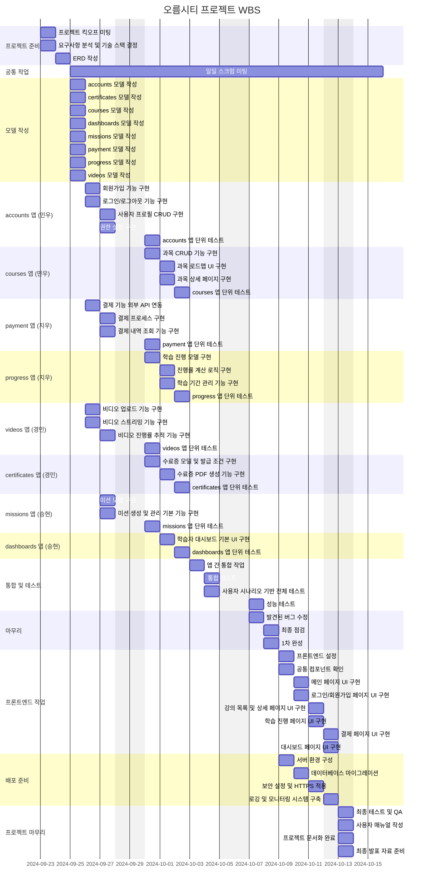
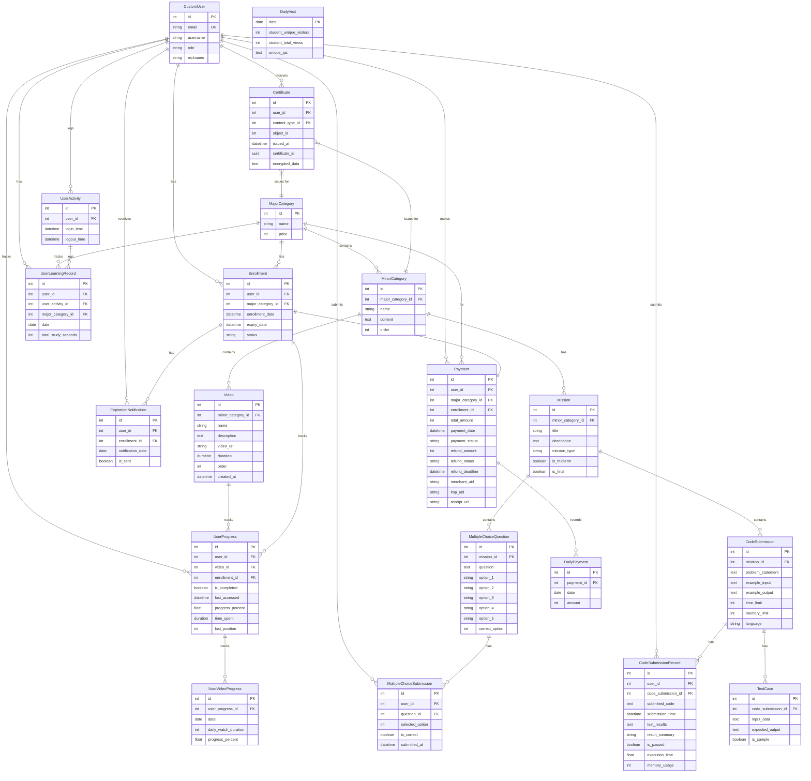

#  오름시티
<a href="#" target="_blank">

</a>
*최종 작성 후 순서 및 목차인덱싱 예정

<br/>
<br/>

# 프로젝트 목표 및 주요 기능

## 프로젝트 목표
오름시티는 ICT(정보통신기술) 온라인 교육 플랫폼입니다. 이 프로젝트의 주요 목표는 학습자가 이론과 실습을 균형 있게 학습할 수 있도록 체계적으로 정리된 커리큘럼과 미션 과제를 제공하는 것입니다. 프로젝트는 사용자 친화적인 환경에서 디지털 수료증 발급, 학습 진행 관리, 결제 기능 등 다양한 학습 및 관리 기능을 통합하여 제공합니다.

## 주요 기능
- **사용자 관리**: JWT 인증을 통한 안전한 사용자 인증 및 관리 기능 제공
- **강의 과목 관리**: 대분류 및 소분류 과목 관리 및 수강 신청 기능
- **동영상 학습**: AWS S3를 이용한 동영상 업로드 및 학습 진행 관리
- **미션 평가 시스템**: 중간 및 기말 미션 제공, 코드 제출과 객관식 문제로 평가
- **수료증 발급**: 디지털 수료증 PDF 발급 및 QR 코드를 통한 수료증 진위 확인
- **결제 시스템**: Portone API를 통한 결제 및 환불 기능

# 🚀시작하기
이 프로젝트는 [PDM](https://pdm.fming.dev/)을 사용하여 Python🐍 패키지를 관리합니다.

- 🛠️ PDM 설치: PDM을 설치하지 않았다면, 아래 명령어로 설치합니다.
```bash
💻 윈도우: pip install pdm
🍏 맥: brew install pdm
```
1. 📁 레포지토리 클론
```
git clone https://github.com/orm-city/BE-orm-city.git
```
2. 📦 PDM을 사용하여 의존성 설치
```
pdm install
```
3. 🚀 Django 서버 실행
```
pdm run python manage.py migrate
pdm run python manage.py runserver
```

4. 🌐 브라우저에서 확인<br>
[http://127.0.0.1:8000](http://127.0.0.1:8000)

<br/>
<br/>

# 📚 프로젝트 개요
- 프로젝트 이름: 오름시티🏙️
  <br/>
- 프로젝트 설명: ICT(정보통신기술) 💻 온라인 교육 플랫폼으로 각 과정은 체계적으로 정리된 📋 커리큘럼을 바탕으로 미션 과제를 통해 학습자가 📖 이론과 🛠️ 실습을 균형 있게 학습할 수 있도록 서비스를 제공합니다.
  <br/>
- 프로젝트 기간: **24.09.20 ~ 24.10.13** 📅
- 프로젝트 배포: [orm-city.site](orm-city.site) (24년 10월 25일까지 개방)
- 프로젝트 노션: 📝 [Notion Link](https://www.notion.so/orm-city-10f790e56418808ba347f5c871e470f8?pvs=4)

<br/>
<br/>


# 팀원 및 팀 소개
| 고경민 | 남민우 | 장지우 | 백승현 |
|:------:|:------:|:------:|:------:|
|  |  |  |  |
| PL<br/>(BE/FE) | BE | BE/FE | BE |
| [GitHub](https://github.com/cumulus308) | [GitHub](https://github.com/NamMinWoo91) | [GitHub](https://github.com/cheeou) | [GitHub](https://github.com/baccine) |

<br/>
<br/>

# 작업 및 역할 분담

| **이름** | 고경민 | 남민우 | 장지우 | 백승현 |
|-------------|--------|--------|--------|--------|
| **담당 <br/>역할** | ▪︎ 📋 프로젝트 계획 및 관리<br>▪︎🎥 영상 컨텐츠 업로드 기능<br>▪︎🎓 수강증 인증 기능<br>▪︎📊 미션 평가 기능<br>▪︎🌐 배포 환경 구축<br>▪︎🖥️ FE 구축| ▪︎ 👤 사용자 관리 기능<br>▪︎  📚강의 과목 관리 기능 | ▪︎ 💳 강의 결제 기능<br>▪︎ 📈 학습 진행 관리 기능<br>▪︎ 🖥️ FE 구축 |▪︎✍️ 미션 초안 작성<br>▪︎📋 컨벤션에 맞추어 정리<br>▪︎📜 schema 작성|


<br/>
<br/>


# 🛠️ 기술 스택


### Frontend
  


### Backend

  


### InfraStructure
 
     


### Project Management
  
 


### Third-party
| 패키지 이름                         | 버전        |
|-------------------------------------|-------------|
| django-cors-headers                 | 4.4.0       |
| djangorestframework-simplejwt       | 5.3.1       |
| drf-spectacular                     | 0.27.2      |
| boto3                               | 1.35.26     |
| botocore                            | 1.35.26     |
| pre-commit                          | 3.8.0       |
| psycopg                             | 3.2.2       |
| psycopg2-binary                     | 2.9.9       |
| pycryptodome                        | 3.21.0      |
| PyJWT                               | 2.9.0       |
| pytest                              | 8.3.3       |
| pytest-django                       | 4.9.0       |
| PyYAML                              | 6.0.2       |
| qrcode                              | 8.0         |


## 🛠️ 환경

### 📅 일정 관리
- 개발에 집중할 수 있는 환경 조성
- 📊 Jira, 📋 Notion, 🐱 GitHub을 연동하여 Notion에서 통합 관리가 가능하도록 설정
- GitHub에서 Issue를 발행하면, 자동으로 Jira에 이슈가 생성되고, 이슈 키 번호를 기반으로 브랜치가 자동 생성
- 생성된 브랜치가 머지되면, Jira 이슈가 자동으로 완료 처리
- 모든 이슈 관련 정보는 Notion에서 확인 가능, 이를 통해 컨벤션, 요구 명세서, API 명세서를 한 페이지에서 관리

### 🔄 CI/CD
- 🛑 Pre-commit hook을 사용하여 코드 품질 검사 자동화
- Main 브랜치에 PR이 올라오면 Ruff로 코드 스타일을 검사
- 🧪 Pytest로 테스트 진행
- GitHub Actions로 이미지를 빌드 및 배포
- 🔒 SSH 접속 후 Docker 이미지를 pull하여 컨테이너 실행

### 🛠️ 개발
🔒 JWT 인증
- djangorestframework-simplejwt를 이용하여 사용자 인증을 진행

🎓 강의 수료증
- reportlab을 활용하여 수료증을 📄 PDF로 출력
- pycryptodome으로 수료증 번호를 🔐 암호화
- qrcode[pil]로 수료증의 진위 여부를 확인할 수 있는 📱 QR코드를 생성

💳 강의 결제
- Portone API를 활용하여 결제 및 환불 기능을 구현

🎥 강의 영상
- Boto3를 활용하여 ☁️ S3 스토리지에 파일 업로드
- Presigned URL을 사용하여 파일에 접근
- 어뷰징 방지를 위해 ⏱️ Throttle Rate를 적용

### 🔮 브랜치 전략 (Branch Strategy)
브랜치 전략은 Git Flow를 기반으로 하며, 아래 구조와 같이 개발 작업을 진행하였습니다.

- Main Branch
  - 배포 가능한 상태의 코드를 유지합니다.
  - 모든 배포는 이 브랜치에서 이루어집니다.

- Dev Branch
  - 배포를 위한 개발 브랜치입니다.
  - 모든 기능 개발 취합이 해당 브랜치에서 이루어집니다.

- Issue Branch
  - GitHub 이슈 생성 시 Jira와 GitHub Actions 자동화를 통해 작업 브랜치가 자동 생성되어 개발을 작업을 진행합니다.

<br/>
<br/>


# 개발일정(WBS)

<br/>

# 데이터베이스 모델링(ERD)
[ERD 이미지](README_img\erd-orm-city.jpg) 보기

<br/>


# 프로젝트 아키텍처


<br/>
<br/>

# 🌟 메인 기능
- **👤 사용자 관리**:
  - JWT와 리프레시 토큰을 통해 안전하고 효율적인 사용자 인증 및 권한 관리 기능을 구현했습니다.
  - 회원가입, 로그인, 로그아웃 기능을 제공합니다.
  - 사용자 역할은 관리자, 수강생으로 구분되며, 개인정보 수정 및 프로필 관리가 가능합니다.

- **📚 강의 과목 관리**:
  - 대분류와 소분류 과목을 체계적으로 관리할 수 있습니다.
  - 수강신청 및 수강 기간을 관리하며, 과목별 진행률이 자동으로 계산됩니다.

- **🎥 동영상 학습 시스템**:
  - ☁️ AWS S3의 멀티파트 업로드 기능을 사용하여 동영상을 효율적으로 업로드하고 관리하는 시스템을 구현하였습니다.

- **📈 학습 진행 관리**:
  - 사용자는 자신의 학습 진행 상황을 확인하고, 동영상 시청 기록을 관리할 수 있습니다.

- **🎓수강증 인증 시스템**:
  - 각 과목별로 디지털 수료증 PDF 추출 발급 및 수료증 진위 확인이 가능합니다.

- **대시보드**:
  - 관리자는 일별 접속자 수와 매출 통계를 확인할 수 있으며, 학습자는 자신의 학습 진행 상황과 남은 미션을 확인할 수 있습니다.

- **🔒 권한 관리**:
  - 관리자와 사용자 역할에 따른 권한을 설정하고 관리할 수 있습니다.

- **📝 미션 평가 시스템**:
  - 각 과목별로 중간/기말 시험을 포함한 미션이 제공되며, 객관식 문제와 코드 제출 문제를 통해 학습자의 이해도를 평가할 수 있습니다.

- **💳 결제 시스템**:
  - 아임포트 결제 시스템 연동으로 사용자는 과목을 결제하고 결제 내역을 조회할 수 있으며, 환불 요청도 가능합니다.
<br/>

# 🔗 URL 구조(마이크로식)

 ### 파일 트리
 ```
 📦ORM_CITY
┣ 📂.github
┃ ┣ 📂ISSUE_TEMPLATE
┃ ┃ ┗ 📜issue_form.yml
┃ ┣ 📂workflows
┃ ┃ ┣ 📜build.yml
┃ ┃ ┣ 📜create_issue_and_branch.yml
┃ ┃ ┗ 📜lint.yml
┃ ┗ 📜PULL_REQUEST_TEMPLATE.md
┣ 📂.venv
┣ 📂README_img
┣ 📂scripts
┃ ┗ 📜prepare-commit-msg
┣ 📂src
┃ ┣ 📂accounts
┃ ┃ ┣ 📂__pycache__
┃ ┃ ┣ 📂migrations
┃ ┃ ┣ 📜__init__.py
┃ ┃ ┣ 📂tests
┃ ┃ ┣ 📜admin.py
┃ ┃ ┣ 📜apps.py
┃ ┃ ┣ 📜models.py
┃ ┃ ┣ 📜permissions.py
┃ ┃ ┣ 📜serializers.py
┃ ┃ ┣ 📜urls.py
┃ ┃ ┗ 📜views.py
┃ ┣ 📂certificates
┃ ┃ ┣ 📂__pycache__
┃ ┃ ┣ 📂migrations
┃ ┃ ┣ 📜__init__.py
┃ ┃ ┣ 📂tests
┃ ┃ ┣ 📜admin.py
┃ ┃ ┣ 📜apps.py
┃ ┃ ┣ 📜models.py
┃ ┃ ┣ 📜permissions.py
┃ ┃ ┣ 📜serializers.py
┃ ┃ ┣ 📜services.py
┃ ┃ ┣ 📜urls.py
┃ ┃ ┗ 📜views.py
┃ ┣ 📂config
┃ ┃ ┣ 📂__pycache__
┃ ┃ ┣ 📂settings
┃ ┃ ┃ ┣ 📂__pycache__
┃ ┃ ┃ ┣ 📜__init__.py
┃ ┃ ┃ ┣ 📜base.py
┃ ┃ ┃ ┣ 📜dev.py
┃ ┃ ┃ ┣ 📜docker.py
┃ ┃ ┃ ┗ 📜prod.py
┃ ┃ ┣ 📜asgi.py
┃ ┃ ┣ 📜urls.py
┃ ┃ ┗ 📜wsgi.py
┃ ┣ 📂core
┃ ┣ 📂courses
┃ ┃ ┣ 📂__pycache__
┃ ┃ ┣ 📂migrations
┃ ┃ ┣ 📜__init__.py
┃ ┃ ┣ 📂tests
┃ ┃ ┣ 📜admin.py
┃ ┃ ┣ 📜apps.py
┃ ┃ ┣ 📜models.py
┃ ┃ ┣ 📜permissions.py
┃ ┃ ┣ 📜serializers.py
┃ ┃ ┣ 📜services.py
┃ ┃ ┣ 📜signals.py
┃ ┃ ┣ 📜tests.py
┃ ┃ ┣ 📜urls.py
┃ ┃ ┗ 📜views.py
┃ ┣ 📂dashboards
┃ ┣ 📂missions
┃ ┃ ┣ 📂__pycache__
┃ ┃ ┣ 📂migrations
┃ ┃ ┣ 📜__init__.py
┃ ┃ ┣ 📂tests
┃ ┃ ┣ 📜admin.py
┃ ┃ ┣ 📜apps.py
┃ ┃ ┣ 📜models.py
┃ ┃ ┣ 📜permissions.py
┃ ┃ ┣ 📜serializers.py
┃ ┃ ┣ 📜services.py
┃ ┃ ┣ 📜urls.py
┃ ┃ ┗ 📜views.py
┃ ┣ 📂payment
┃ ┃ ┣ 📂__pycache__
┃ ┃ ┣ 📂migrations
┃ ┃ ┣ 📂tests
┃ ┃ ┣ 📜__init__.py
┃ ┃ ┣ 📜admin.py
┃ ┃ ┣ 📜apps.py
┃ ┃ ┣ 📜models.py
┃ ┃ ┣ 📜permissions.py
┃ ┃ ┣ 📜serializers.py
┃ ┃ ┣ 📜tests.py
┃ ┃ ┣ 📜urls.py
┃ ┃ ┗ 📜views.py
┃ ┣ 📂progress
┃ ┃ ┣ 📂__pycache__
┃ ┃ ┣ 📂migrations
┃ ┃ ┣ 📜__init__.py
┃ ┃ ┣ 📂tests
┃ ┃ ┣ 📜admin.py
┃ ┃ ┣ 📜apps.py
┃ ┃ ┣ 📜models.py
┃ ┃ ┣ 📜permissions.py
┃ ┃ ┣ 📜serializers.py
┃ ┃ ┣ 📜services.py
┃ ┃ ┣ 📜tests.py
┃ ┃ ┣ 📜urls.py
┃ ┃ ┗ 📜views.py
┃ ┣ 📂static
┃ ┣ 📂videos
┃ ┃ ┣ 📂__pycache__
┃ ┃ ┣ 📂migrations
┃ ┃ ┣ 📂tests
┃ ┃ ┣ 📜__init__.py
┃ ┃ ┣ 📜admin.py
┃ ┃ ┣ 📜apps.py
┃ ┃ ┣ 📜models.py
┃ ┃ ┣ 📜permissions.py
┃ ┃ ┣ 📜serializers.py
┃ ┃ ┣ 📜services.py
┃ ┃ ┣ 📜urls.py
┃ ┃ ┗ 📜views.py
┃ ┗ 📜manage.py
┣ 📂tests
┣ 📂trobleshootings
┣ 📜.gitignore
┣ 📜.pdm-python
┣ 📜.pre-commit-config.yaml
┣ 📜Dockerfile
┣ 📜pdm.lock
┣ 📜pyproject.toml
┣ 📜README.md
┣ 📜requirements.txt
┣ 📜reset_mig.sh
┗ 📜reset_migrations.ps1
```

### ☑︎ accounts
| HTTP Method | URL Pattern | Description | Authentication | Permission |
|-------------|-------------|-------------|----------------|------------|
| POST | /accounts/register/ | 새 사용자 등록 | - | - |
| POST | /accounts/login/ | 사용자 로그인 | ✅ | |
| POST | /accounts/logout/ | 사용자 로그아웃 | ✅ | |
| GET/PUT | /accounts/profile/ | 사용자 프로필 조회 및 수정 | ✅ | |
| GET | /accounts/activity/ | 사용자 활동 기록 조회 | ✅ | |
| DELETE | /accounts/delete/ | 계정 삭제 | ✅ | |
| POST | /accounts/create-manager/ | 관리자 계정 생성 | ✅ | ✅ |
| PATCH | /accounts/change-role/int:user_id/ | 사용자 역할 변경 | ✅ | ✅ |

<br/>

## ☑︎ certificates
| HTTP Method | URL Pattern | Description | Authentication | Permission |
|-------------|-------------|-------------|----------------|------------|
| GET | /certificates/ | 발급 가능한 수료증 목록 조회 | ✅ | |
| GET | /certificates/preview/<br/>str:course_type/int:course_id/ | 수료증 미리보기 | ✅ | ✅ |
| GET | /certificates/download/<br/>str:course_type/int:course_id/ | 수료증 다운로드 | ✅ | ✅ |
| GET | /certificates/verify/uuid:certificate_id/ | 수료증 검증 | - | - |

<br/>

## ☑︎ courses
| HTTP Method | URL Pattern | Description | Authentication | Permission |
|-------------|-------------|-------------|----------------|------------|
| GET/POST | /courses/major-categories/ | 대분류 목록 조회 및 생성 | GET - <br/>POST ✅ | GET - <br/>POST ✅ |
| GET/PUT/DELETE | /courses/major-categories/int:pk/ | 대분류 상세 조회, 수정, 삭제 | GET - <br/> PUT/DELETE ✅ | GET - <br/>PUT/DELETE ✅ |
| GET/POST | /courses/minor-categories/ | 소분류 목록 조회 및 생성 | GET - <br/>POST ✅ | GET - <br/>POST ✅ |
| GET/PUT/DELETE | /courses/minor-categories/int:pk/ | 소분류 상세 조회, 수정, 삭제 | GET - <br/>PUT/DELETE ✅ | GET - <br/>PUT/DELETE ✅ |
| GET/POST | /courses/enrollments/ | 수강 신청 목록 조회 및 생성 | ✅ | |
| GET/PUT/DELETE | /courses/enrollments/int:pk/ | 수강 신청 상세 조회, 수정, 삭제 | ✅ | ✅ |
| POST | /courses/enrollments/int:pk/complete/ | 수강 완료 처리 | ✅ | ✅ |
<br/>

## ☑︎ dashboards
| HTTP Method | URL Pattern | Description | Authentication | Permission |
|-------------|-------------|-------------|----------------|------------|
| GET | /dashboards/summary/ | 대시보드 요약 정보 | ✅ | ✅ |
| GET | /dashboards/daily-visits/ | 일일 방문자 통계 | ✅ | ✅ |
| GET | /dashboards/daily-payments/ | 일일 결제 통계 | ✅ | ✅ |
| GET | /dashboards/learning-records/ | 사용자 학습 기록 | ✅ | ✅ |
| GET | /dashboards/video-progress/ | 비디오 진행 상황 | ✅ | ✅ |
| GET | /dashboards/expiration-notifications/ | 만료 알림 목록 | ✅ | ✅ |
| GET | /dashboards/student-dashboard/ | 학생 대시보드 정보 | ✅ | ✅ |
<br/>

## ☑︎ missions

| HTTP Method | URL Pattern | Description | Authentication | Permission |
|-------------|-------------|------|-----------|------|
| GET/PUT/PATCH | /missions/{id}/ | 특정 미션의 세부 정보 조회,수정,업데이트 | ✅ | ✅ |
| GET/POST | /missions/<br/>code-submission-questions/ | 코드 제출 전체 문제 목록 조회,생성 | ✅ | ✅ |
| GET/PUT<br/>/PATCH/DELETE | /missions/<br/>code-submission-questions/{id}/ | 특정 코드 제출 CRUD | ✅ | ✅ |
| GET | /missions/code-submissions/ | 코드 제출 목록 조회,생성 | ✅ | ✅ |
| POST | /missions/code-submissions/<br/>{code_submission_id}/evaluate/ | 제출된 코드 평가 | ✅ | ✅ |
| GET/PUT<br/>/PATCH/DELETE | /missions/<br/>code-submissions/{id}/ | 특정 코드 제출 CRUD | ✅ | ✅ |
| GET | /missions/major/{major_id}/<br/>{minor_id}/{mid_or_final}/cs/ | 특정 분류의 코드 제출 문제 목록 조회 | ✅ | ✅ |
| GET | /missions/major/{major_id}/<br/>{minor_id}/{mid_or_final}/mcqs/ | 특정 분류의 객관식 문제 목록 조회 | ✅ | ✅ |
| GET/POST | /missions/multiple-choice-questions/ | 객관식 문제 목록 조회,생성 | ✅ | ✅ |
| GET/POST<br/>/PUT/PATCH/DELETE | /missions<br/>/multiple-choice-questions/{id}/ | 특정 객관식 문제 CRUD | ✅ | ✅ |
| GET | /missions/submissions/all/cs/ | 모든 사용자의 코드 제출 내역 조회 | ✅ | ✅ |
| GET | /missions/submissions/all/mcqs/ | 모든 사용자의 객관식 문제 제출 내역 조회 | ✅ | ✅ |
| GET | /missions/submissions/user/cs/ | 현재 사용자의 코드 제출 내역 조회 | ✅ | ✅ |
| GET | /missions/submissions/user/mcqs/ | 현재 사용자의 객관식 문제 제출 내역 조회 | ✅ | ✅ |


<br/>

## ☑︎ payment
| HTTP Method | URL Pattern | Description | Authentication | Permission |
|-------------|-------------|-------------|----------------|------------|
| GET | /payment/info/int:major_category_id/ | 결제 정보 조회 | ✅ | |
| POST | /payment/complete/ | 결제 완료 처리 | ✅ | |
| GET | /payment/user-payments/ | 사용자 결제 내역 조회 | ✅ | |
| GET | /payment/detail/int:payment_id/ | 특정 결제 상세 정보 조회 | ✅ | ✅ |
| POST | /payment/refund/int:payment_id/ | 환불 요청 처리 | ✅ | ✅ |


<br/>

## ☑︎ progress
| HTTP Method | URL Pattern | Description | Authentication | Permission |
|-------------|-------------|-------------|----------------|------------|
| GET | /progress/ | 사용자의 전체 학습 진행률 조회 | ✅ | |
| PATCH | /progress/update/int:pk/ | 특정 강의 학습 수강 상태 업데이트 | ✅ | |
| GET | /progress/overall/ | 사용자의 강의 카테고리별 수강 진행률 조회 | ✅ | |
| GET | /progress/video/int:video_id/ | 특정 강의 학습 진행률  조회 | ✅ | |

<br/>

## ☑︎ videos
| HTTP Method | URL Pattern | Description | Authentication | Permission |
|-------------|-------------|-------------|----------------|------------|
| GET/POST | /videos/ | 비디오 목록 조회 및 생성 | GET - <br/>POST ✅ | GET - <br/>POST ✅ |
| GET/PUT/DELETE | /videos/int:pk/ | 비디오 상세 조회, 수정, 삭제 | ✅ | ✅ |
| POST | /videos/complete-upload/ | 멀티파트 업로드 완료 처리 | ✅ | ✅ |
| POST | /videos/progress/ | 사용자 비디오 진행 상황 업데이트 | ✅ | ✅ |
<br/>


<br/>


<br/>
<br/>

# 화면구성
<details>
<summary>어드민</summary>

<br/><br/>
<br/><br/>
<br/><br/>
<br/><br/>
<br/><br/>

</details>

<details>
<summary>수강생</summary>
<br/><br/> 
<br/><br/>
<br/><br/> 
<br/><br/> 
<br/><br/> 
<br/><br/> 
<br/><br/>

</details>


<br/>
<br/>

# 트러블슈팅

<br/>
<br/>


# 🧩 Coding Convention
[Notion 링크](https://www.notion.so/10f790e564188073a172ff2adb89c763)


# 프로젝트 회고

### 고경민
```
몰랐기에 과감하게 도전했던 프로젝트였습니다.

```
<br/>
<br/>

### 남민우
```
```

<br/>
<br/>


### 장지우
```
```
<br/>
<br/>

### 백승현

```
```
<br/>
<br/>

<br/>
