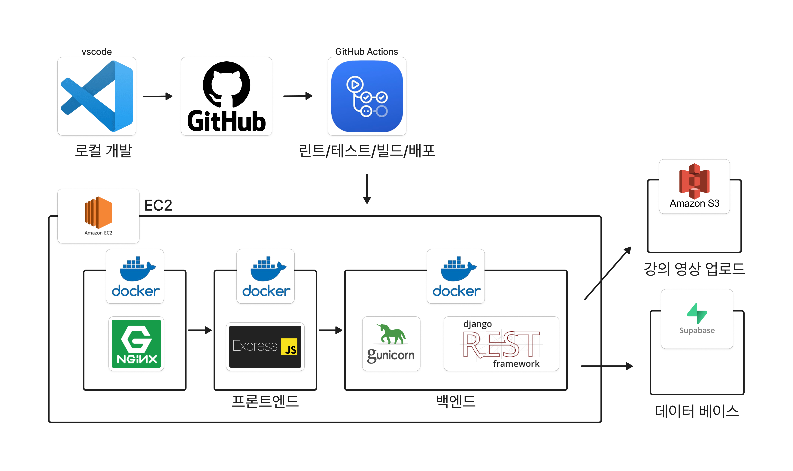

#  오름시티
<a href="#" target="_blank">

</a>

<br/>
<br/>

# 1. 프로젝트 목표 및 주요 기능

## 1.1 프로젝트 목표
오름시티는 ICT(정보통신기술) 온라인 교육 플랫폼입니다. 이 프로젝트의 주요 목표는 학습자가 이론과 실습을 균형 있게 학습할 수 있도록 체계적으로 정리된 커리큘럼과 미션 과제를 제공하는 것입니다. 프로젝트는 사용자 친화적인 환경에서 디지털 수료증 발급, 학습 진행 관리, 결제 기능 등 다양한 학습 및 관리 기능을 통합하여 제공합니다.

## 1.2 주요 기능
- **사용자 관리**: JWT 인증을 통한 안전한 사용자 인증 및 관리 기능 제공
- **강의 과목 관리**: 대분류 및 소분류 과목 관리 및 수강 신청 기능
- **동영상 학습**: AWS S3를 이용한 동영상 업로드 및 학습 진행 관리
- **미션 평가 시스템**: 중간 및 기말 미션 제공, 코드 제출과 객관식 문제로 평가
- **수료증 발급**: 디지털 수료증 PDF 발급 및 QR 코드를 통한 수료증 진위 확인
- **결제 시스템**: Portone API를 통한 결제 및 환불 기능


<br/>
<br/>

# 2. 🚀 시작하기
이 프로젝트는 [PDM](https://pdm.fming.dev/)을 사용하여 Python🐍 패키지를 관리합니다.

- 🛠️ PDM 설치: PDM을 설치하지 않았다면, 아래 명령어로 설치합니다.
```bash
💻 윈도우: pip install pdm
🍏 맥: brew install pdm
```
## 2.1  📁 레포지토리 클론
```
git clone https://github.com/orm-city/BE-orm-city.git
```
## 2.2 📦 PDM을 사용하여 의존성 설치
```
pdm install
```
## 2.3 🚀 Django 서버 실행
```
pdm run python manage.py migrate
pdm run python manage.py runserver
```
또는 PDM 스크립트를 작성해두었기 떄무에 아래 명령어를 실행해 주세요.
```
pdm mig
pdm r
```
추가적인 스크립트는 `pyproject.toml`의 [tool.pdm.scripts]를 확인하시면 됩니다.
ps. mac의 경우 reset_mig파일, windows의 경우 reset_migrations파일의 제일 위 코드를 실행시키면 모든 마이그레이션 파일이 삭제됩니다.

## 2.4. 🌐 브라우저에서 확인<br>
[http://127.0.0.1:8000](http://127.0.0.1:8000)

<br/>
<br/>

# 3. 📚 프로젝트 개요
- 프로젝트 이름: 오름시티🏙️
  <br/>
- 프로젝트 설명: ICT(정보통신기술) 💻 온라인 교육 플랫폼으로 각 과정은 체계적으로 정리된 📋 커리큘럼을 바탕으로 미션 과제를 통해 학습자가 📖 이론과 🛠️ 실습을 균형 있게 학습할 수 있도록 서비스를 제공합니다.
  <br/>
- 프로젝트 기간: **24.09.20 ~ 24.10.13** 📅
- 프로젝트 배포: [orm-city.site](http://orm-city.site) (24년 10월 25일까지 개방)
- 프로젝트 노션: 📝 [Notion Link](https://www.notion.so/orm-city-10f790e56418808ba347f5c871e470f8?pvs=4)

<br/>
<br/>


# 4. 팀원 및 팀 소개
| 고경민 | 남민우 | 장지우 | 백승현 |
|:------:|:------:|:------:|:------:|
|  |  |  |  |
| PL<br/>(BE/FE) | BE | BE/FE | BE |
| [GitHub](https://github.com/cumulus308) | [GitHub](https://github.com/NamMinWoo91) | [GitHub](https://github.com/cheeou) | [GitHub](https://github.com/baccine) |

<br/>


## 4.1 작업 및 역할 분담

| **이름** | 고경민 | 남민우 | 장지우 | 백승현 |
|-------------|--------|--------|--------|--------|
| **담당 <br/>역할** | ▪︎ 📋 프로젝트 계획 및 관리<br>▪︎🎥 영상 컨텐츠 업로드 기능<br>▪︎🎓 수강증 인증 기능<br>▪︎📊 미션 평가 기능<br>▪︎🌐 배포 환경 구축<br>▪︎🖥️ FE 구축| ▪︎ 👤 사용자 관리 기능<br>▪︎  📚강의 과목 관리 기능<br>▪︎ 📝 문서 정리 | ▪︎ 💳 강의 결제 기능<br>▪︎ 📈 학습 진행 관리 기능<br>▪︎ 🖥️ FE 구축 |▪︎✍️ 미션 초안 작성<br>▪︎📋 컨벤션에 맞추어 정리<br>▪︎📜 schema 작성|


<br/>
<br/>


# 5. 🛠️ 기술 스택


## 5.1 Frontend
  


## 5.2 Backend

  


## 5.3 InfraStructure
 
     


## 5.4 Project Management
  
 


## 5.5 Third-party
| 패키지 이름                         | 버전        |
|-------------------------------------|-------------|
| django-cors-headers                 | 4.4.0       |
| djangorestframework-simplejwt       | 5.3.1       |
| drf-spectacular                     | 0.27.2      |
| boto3                               | 1.35.26     |
| botocore                            | 1.35.26     |
| pre-commit                          | 3.8.0       |
| psycopg                             | 3.2.2       |
| psycopg2-binary                     | 2.9.9       |
| pycryptodome                        | 3.21.0      |
| PyJWT                               | 2.9.0       |
| pytest                              | 8.3.3       |
| pytest-django                       | 4.9.0       |
| PyYAML                              | 6.0.2       |
| qrcode                              | 8.0         |

<br/>
<br/>

# 6. 🛠️ 환경

## 6.1 📅 일정 관리
- 개발에 집중할 수 있는 환경 조성
- 📊 Jira, 📋 Notion, 🐱 GitHub을 연동하여 Notion에서 통합 관리가 가능하도록 설정
- GitHub에서 Issue를 발행하면, 자동으로 Jira에 이슈가 생성되고, 이슈 키 번호를 기반으로 브랜치가 자동 생성
- 생성된 브랜치가 머지되면, Jira 이슈가 자동으로 완료 처리
- 모든 이슈 관련 정보는 Notion에서 확인 가능, 이를 통해 컨벤션, 요구 명세서, API 명세서를 한 페이지에서 관리

## 6.2 🔄 CI/CD
- 🛑 Pre-commit hook을 사용하여 코드 품질 검사 자동화
- Main 브랜치에 PR이 올라오면 Ruff로 코드 스타일을 검사
- 🧪 Pytest로 테스트 진행
- GitHub Actions로 이미지를 빌드 및 배포
- 🔒 SSH 접속 후 Docker 이미지를 pull하여 컨테이너 실행

## 6.3 🔮 브랜치 전략 (Branch Strategy)
브랜치 전략은 Git Flow를 기반으로 하며, 아래 구조와 같이 개발 작업을 진행하였습니다.

- Main Branch
  - 배포 가능한 상태의 코드를 유지합니다.
  - 모든 배포는 이 브랜치에서 이루어집니다.

- Dev Branch
  - 배포를 위한 개발 브랜치입니다.
  - 모든 기능 개발 취합이 해당 브랜치에서 이루어집니다.

- Issue Branch
  - GitHub 이슈 생성 시 Jira와 GitHub Actions 자동화를 통해 작업 브랜치가 자동 생성되어 개발을 작업을 진행합니다.

<br/>
<br/>

# 7. 🛠️ 개발

## 7.1 🔒 JWT 인증
- djangorestframework-simplejwt를 이용하여 사용자 인증을 진행

## 7.2 🎓 강의 수료증
- reportlab을 활용하여 수료증을 📄 PDF로 출력
- pycryptodome으로 수료증 번호를 🔐 암호화
- qrcode[pil]로 수료증의 진위 여부를 확인할 수 있는 📱 QR코드를 생성

## 7.3  💳 강의 결제
- Portone API를 활용하여 결제 및 환불 기능을 구현

## 7.4 🎥 강의 영상
- Boto3를 활용하여 ☁️ S3 스토리지에 파일 업로드
- Presigned URL을 사용하여 파일에 접근
- 어뷰징 방지를 위해 ⏱️ Throttle Rate를 적용

## 7.5 📋 객관식 & 주관식 문제
- 실제 코드를 입력받아 🖥️ `subprocess`를 활용해 코드를 실행하고, 결과에 따라 자동 채점을 진행
- 코드를 안전하게 실행하기 위해 ⏱️ 실행 시간과 💾 메모리를 제한


<br/>
<br/>


# 8. 개발일정(WBS)

<br/>

# 9. 데이터베이스 모델링(ERD)
[ERD 이미지 보기](README_img/erd-orm-city.jpg)

<br/>
<br/>

# 10. 프로젝트 아키텍처


<br/>
<br/>

# 11. 🌟 메인 기능
- **👤 사용자 관리**:
  - JWT와 리프레시 토큰을 통해 안전하고 효율적인 사용자 인증 및 권한 관리 기능을 구현했습니다.
  - 회원가입, 로그인, 로그아웃 기능을 제공합니다.
  - 사용자 역할은 관리자, 수강생으로 구분되며, 개인정보 수정 및 프로필 관리가 가능합니다.

- **📚 강의 과목 관리**:
  - 대분류와 소분류 과목을 체계적으로 관리할 수 있습니다.
  - 수강신청 및 수강 기간을 관리하며, 과목별 진행률이 자동으로 계산됩니다.

- **🎥 동영상 학습 시스템**:
  - ☁️ AWS S3의 멀티파트 업로드 기능을 사용하여 동영상을 효율적으로 업로드하고 관리하는 시스템을 구현하였습니다.

- **📈 학습 진행 관리**:
  - 사용자는 자신의 학습 진행 상황을 확인하고, 동영상 시청 기록을 관리할 수 있습니다.

- **🎓수강증 인증 시스템**:
  - 각 과목별로 디지털 수료증 PDF 추출 발급 및 수료증 진위 확인이 가능합니다.

- **🔒 권한 관리**:
  - 관리자와 사용자 역할에 따른 권한을 설정하고 관리할 수 있습니다.

- **📝 미션 평가 시스템**:
  - 각 과목별로 중간/기말 시험을 포함한 미션이 제공되며, 객관식 문제와 코드 제출 문제를 통해 학습자의 이해도를 평가할 수 있습니다.

- **💳 결제 시스템**:
  - 아임포트 결제 시스템 연동으로 사용자는 과목을 결제하고 결제 내역을 조회할 수 있으며, 환불 요청도 가능합니다.

<br/>
<br/>

# 12. 프로젝트 구조


 <details>
  <summary>📂 파일 트리 보기</summary>

 ```
 📦ORM_CITY
┣ 📂.github
┃ ┣ 📂ISSUE_TEMPLATE
┃ ┃ ┗ 📜issue_form.yml
┃ ┣ 📂workflows
┃ ┃ ┣ 📜build.yml
┃ ┃ ┣ 📜create_issue_and_branch.yml
┃ ┃ ┗ 📜lint.yml
┃ ┗ 📜PULL_REQUEST_TEMPLATE.md
┣ 📂.venv
┣ 📂README_img
┣ 📂scripts
┃ ┗ 📜prepare-commit-msg
┣ 📂src
┃ ┣ 📂accounts
┃ ┃ ┣ 📂__pycache__
┃ ┃ ┣ 📂migrations
┃ ┃ ┣ 📜__init__.py
┃ ┃ ┣ 📂tests
┃ ┃ ┣ 📜admin.py
┃ ┃ ┣ 📜apps.py
┃ ┃ ┣ 📜models.py
┃ ┃ ┣ 📜permissions.py
┃ ┃ ┣ 📜serializers.py
┃ ┃ ┣ 📜urls.py
┃ ┃ ┗ 📜views.py
┃ ┣ 📂certificates
┃ ┃ ┣ 📂__pycache__
┃ ┃ ┣ 📂migrations
┃ ┃ ┣ 📜__init__.py
┃ ┃ ┣ 📂tests
┃ ┃ ┣ 📜admin.py
┃ ┃ ┣ 📜apps.py
┃ ┃ ┣ 📜models.py
┃ ┃ ┣ 📜permissions.py
┃ ┃ ┣ 📜serializers.py
┃ ┃ ┣ 📜services.py
┃ ┃ ┣ 📜urls.py
┃ ┃ ┗ 📜views.py
┃ ┣ 📂config
┃ ┃ ┣ 📂__pycache__
┃ ┃ ┣ 📂settings
┃ ┃ ┃ ┣ 📂__pycache__
┃ ┃ ┃ ┣ 📜__init__.py
┃ ┃ ┃ ┣ 📜base.py
┃ ┃ ┃ ┣ 📜dev.py
┃ ┃ ┃ ┣ 📜docker.py
┃ ┃ ┃ ┗ 📜prod.py
┃ ┃ ┣ 📜asgi.py
┃ ┃ ┣ 📜urls.py
┃ ┃ ┗ 📜wsgi.py
┃ ┣ 📂core
┃ ┣ 📂courses
┃ ┃ ┣ 📂__pycache__
┃ ┃ ┣ 📂migrations
┃ ┃ ┣ 📜__init__.py
┃ ┃ ┣ 📂tests
┃ ┃ ┣ 📜admin.py
┃ ┃ ┣ 📜apps.py
┃ ┃ ┣ 📜models.py
┃ ┃ ┣ 📜permissions.py
┃ ┃ ┣ 📜serializers.py
┃ ┃ ┣ 📜services.py
┃ ┃ ┣ 📜signals.py
┃ ┃ ┣ 📜tests.py
┃ ┃ ┣ 📜urls.py
┃ ┃ ┗ 📜views.py
┃ ┣ 📂dashboards
┃ ┣ 📂missions
┃ ┃ ┣ 📂__pycache__
┃ ┃ ┣ 📂migrations
┃ ┃ ┣ 📜__init__.py
┃ ┃ ┣ 📂tests
┃ ┃ ┣ 📜admin.py
┃ ┃ ┣ 📜apps.py
┃ ┃ ┣ 📜models.py
┃ ┃ ┣ 📜permissions.py
┃ ┃ ┣ 📜serializers.py
┃ ┃ ┣ 📜services.py
┃ ┃ ┣ 📜urls.py
┃ ┃ ┗ 📜views.py
┃ ┣ 📂payment
┃ ┃ ┣ 📂__pycache__
┃ ┃ ┣ 📂migrations
┃ ┃ ┣ 📂tests
┃ ┃ ┣ 📜__init__.py
┃ ┃ ┣ 📜admin.py
┃ ┃ ┣ 📜apps.py
┃ ┃ ┣ 📜models.py
┃ ┃ ┣ 📜permissions.py
┃ ┃ ┣ 📜serializers.py
┃ ┃ ┣ 📜tests.py
┃ ┃ ┣ 📜urls.py
┃ ┃ ┗ 📜views.py
┃ ┣ 📂progress
┃ ┃ ┣ 📂__pycache__
┃ ┃ ┣ 📂migrations
┃ ┃ ┣ 📜__init__.py
┃ ┃ ┣ 📂tests
┃ ┃ ┣ 📜admin.py
┃ ┃ ┣ 📜apps.py
┃ ┃ ┣ 📜models.py
┃ ┃ ┣ 📜permissions.py
┃ ┃ ┣ 📜serializers.py
┃ ┃ ┣ 📜services.py
┃ ┃ ┣ 📜tests.py
┃ ┃ ┣ 📜urls.py
┃ ┃ ┗ 📜views.py
┃ ┣ 📂static
┃ ┣ 📂videos
┃ ┃ ┣ 📂__pycache__
┃ ┃ ┣ 📂migrations
┃ ┃ ┣ 📂tests
┃ ┃ ┣ 📜__init__.py
┃ ┃ ┣ 📜admin.py
┃ ┃ ┣ 📜apps.py
┃ ┃ ┣ 📜models.py
┃ ┃ ┣ 📜permissions.py
┃ ┃ ┣ 📜serializers.py
┃ ┃ ┣ 📜services.py
┃ ┃ ┣ 📜urls.py
┃ ┃ ┗ 📜views.py
┃ ┗ 📜manage.py
┣ 📂tests
┣ 📂trobleshootings
┣ 📜.gitignore
┣ 📜.pdm-python
┣ 📜.pre-commit-config.yaml
┣ 📜Dockerfile
┣ 📜pdm.lock
┣ 📜pyproject.toml
┣ 📜README.md
┣ 📜requirements.txt
┣ 📜reset_mig.sh
┗ 📜reset_migrations.ps1
```
 </details>
<br/>
<br/>


# 13. API 명세서

### ☑︎ accounts
| HTTP Method | URL Pattern | Description | Authentication | Permission |
|-------------|-------------|-------------|----------------|------------|
| POST | /accounts/register/ | 새 사용자 등록 | - | - |
| POST | /accounts/login/ | 사용자 로그인 | ✅ | |
| POST | /accounts/logout/ | 사용자 로그아웃 | ✅ | |
| GET/PUT | /accounts/profile/ | 사용자 프로필 조회 및 수정 | ✅ | |
| GET | /accounts/activity/ | 사용자 활동 기록 조회 | ✅ | |
| DELETE | /accounts/delete/ | 계정 삭제 | ✅ | |
| POST | /accounts/create-manager/ | 관리자 계정 생성 | ✅ | ✅ |
| PATCH | /accounts/change-role/int:user_id/ | 사용자 역할 변경 | ✅ | ✅ |

<br/>

## ☑︎ certificates
| HTTP Method | URL Pattern | Description | Authentication | Permission |
|-------------|-------------|-------------|----------------|------------|
| GET | /certificates/ | 발급 가능한 수료증 목록 조회 | ✅ | |
| GET | /certificates/preview/<br/>str:course_type/int:course_id/ | 수료증 미리보기 | ✅ | ✅ |
| GET | /certificates/download/<br/>str:course_type/int:course_id/ | 수료증 다운로드 | ✅ | ✅ |
| GET | /certificates/verify/uuid:certificate_id/ | 수료증 검증 | - | - |

<br/>

## ☑︎ courses
| HTTP Method | URL Pattern | Description | Authentication | Permission |
|-------------|-------------|-------------|----------------|------------|
| GET/POST | /courses/major-categories/ | 대분류 목록 조회 및 생성 | GET - <br/>POST ✅ | GET - <br/>POST ✅ |
| GET/PUT/DELETE | /courses/major-categories/int:pk/ | 대분류 상세 조회, 수정, 삭제 | GET - <br/> PUT/DELETE ✅ | GET - <br/>PUT/DELETE ✅ |
| GET/POST | /courses/minor-categories/ | 소분류 목록 조회 및 생성 | GET - <br/>POST ✅ | GET - <br/>POST ✅ |
| GET/PUT/DELETE | /courses/minor-categories/int:pk/ | 소분류 상세 조회, 수정, 삭제 | GET - <br/>PUT/DELETE ✅ | GET - <br/>PUT/DELETE ✅ |
| GET/POST | /courses/enrollments/ | 수강 신청 목록 조회 및 생성 | ✅ | |
| GET/PUT/DELETE | /courses/enrollments/int:pk/ | 수강 신청 상세 조회, 수정, 삭제 | ✅ | ✅ |
| POST | /courses/enrollments/int:pk/complete/ | 수강 완료 처리 | ✅ | ✅ |
<br/>

## ☑︎ dashboards
| HTTP Method | URL Pattern | Description | Authentication | Permission |
|-------------|-------------|-------------|----------------|------------|
| GET | /dashboards/summary/ | 대시보드 요약 정보 | ✅ | ✅ |
| GET | /dashboards/daily-visits/ | 일일 방문자 통계 | ✅ | ✅ |
| GET | /dashboards/daily-payments/ | 일일 결제 통계 | ✅ | ✅ |
| GET | /dashboards/learning-records/ | 사용자 학습 기록 | ✅ | ✅ |
| GET | /dashboards/video-progress/ | 비디오 진행 상황 | ✅ | ✅ |
| GET | /dashboards/expiration-notifications/ | 만료 알림 목록 | ✅ | ✅ |
| GET | /dashboards/student-dashboard/ | 학생 대시보드 정보 | ✅ | ✅ |
<br/>

## ☑︎ missions

| HTTP Method | URL Pattern | Description | Authentication | Permission |
|-------------|-------------|------|-----------|------|
| GET/PUT/PATCH | /missions/{id}/ | 특정 미션의 세부 정보 조회,수정,업데이트 | ✅ | ✅ |
| GET/POST | /missions/<br/>code-submission-questions/ | 코드 제출 전체 문제 목록 조회,생성 | ✅ | ✅ |
| GET/PUT<br/>/PATCH/DELETE | /missions/<br/>code-submission-questions/{id}/ | 특정 코드 제출 CRUD | ✅ | ✅ |
| GET | /missions/code-submissions/ | 코드 제출 목록 조회,생성 | ✅ | ✅ |
| POST | /missions/code-submissions/<br/>{code_submission_id}/evaluate/ | 제출된 코드 평가 | ✅ | ✅ |
| GET/PUT<br/>/PATCH/DELETE | /missions/<br/>code-submissions/{id}/ | 특정 코드 제출 CRUD | ✅ | ✅ |
| GET | /missions/major/{major_id}/<br/>{minor_id}/{mid_or_final}/cs/ | 특정 분류의 코드 제출 문제 목록 조회 | ✅ | ✅ |
| GET | /missions/major/{major_id}/<br/>{minor_id}/{mid_or_final}/mcqs/ | 특정 분류의 객관식 문제 목록 조회 | ✅ | ✅ |
| GET/POST | /missions/multiple-choice-questions/ | 객관식 문제 목록 조회,생성 | ✅ | ✅ |
| GET/POST<br/>/PUT/PATCH/DELETE | /missions<br/>/multiple-choice-questions/{id}/ | 특정 객관식 문제 CRUD | ✅ | ✅ |
| GET | /missions/submissions/all/cs/ | 모든 사용자의 코드 제출 내역 조회 | ✅ | ✅ |
| GET | /missions/submissions/all/mcqs/ | 모든 사용자의 객관식 문제 제출 내역 조회 | ✅ | ✅ |
| GET | /missions/submissions/user/cs/ | 현재 사용자의 코드 제출 내역 조회 | ✅ | ✅ |
| GET | /missions/submissions/user/mcqs/ | 현재 사용자의 객관식 문제 제출 내역 조회 | ✅ | ✅ |


<br/>

## ☑︎ payment
| HTTP Method | URL Pattern | Description | Authentication | Permission |
|-------------|-------------|-------------|----------------|------------|
| GET | /payment/info/int:major_category_id/ | 결제 정보 조회 | ✅ | |
| POST | /payment/complete/ | 결제 완료 처리 | ✅ | |
| GET | /payment/user-payments/ | 사용자 결제 내역 조회 | ✅ | |
| GET | /payment/detail/int:payment_id/ | 특정 결제 상세 정보 조회 | ✅ | ✅ |
| POST | /payment/refund/int:payment_id/ | 환불 요청 처리 | ✅ | ✅ |


<br/>

## ☑︎ progress
| HTTP Method | URL Pattern | Description | Authentication | Permission |
|-------------|-------------|-------------|----------------|------------|
| GET | /progress/ | 사용자의 전체 학습 진행률 조회 | ✅ | |
| PATCH | /progress/update/int:pk/ | 특정 강의 학습 수강 상태 업데이트 | ✅ | |
| GET | /progress/overall/ | 사용자의 강의 카테고리별 수강 진행률 조회 | ✅ | |
| GET | /progress/video/int:video_id/ | 특정 강의 학습 진행률  조회 | ✅ | |

<br/>

## ☑︎ videos
| HTTP Method | URL Pattern | Description | Authentication | Permission |
|-------------|-------------|-------------|----------------|------------|
| GET/POST | /videos/ | 비디오 목록 조회 및 생성 | GET - <br/>POST ✅ | GET - <br/>POST ✅ |
| GET/PUT/DELETE | /videos/int:pk/ | 비디오 상세 조회, 수정, 삭제 | ✅ | ✅ |
| POST | /videos/complete-upload/ | 멀티파트 업로드 완료 처리 | ✅ | ✅ |
| POST | /videos/progress/ | 사용자 비디오 진행 상황 업데이트 | ✅ | ✅ |
<br/>


<br/>


<br/>
<br/>

# 14. 화면구성
<details>
<summary>어드민</summary>

<table>
    <tr>
        <td>로그인 화면</td>
        <td>메이저 강의 등록및 강의 목록</td>
    </tr>
    <tr>
        <td></td>
        <td></td>
    </tr>
    <tr>
        <td>강의영상 등록</td>
        <td>미션 객관식 문제 등록</td>
    </tr>
    <tr>
        <td></td>
        <td></td>
    </tr>
    <tr>
        <td>미션 주관식 문제 등록</td>
        <td></td>
    </tr>
    <tr>
        <td></td>
        <td></td>
    </tr>
</table>


</details>

<details>
<summary>수강생</summary>
<table>
    <tr>
        <td>비디오 시청</td>
        <td>수료증 미리보기</td>
    </tr>
    <tr>
        <td></td>
        <td></td>
    </tr>
    <tr>
        <td>수료증 다운로드</td>
        <td>퀴즈응시및채점결과조회</td>
    </tr>
    <tr>
        <td> </td>
        <td> </td>
    </tr>
    <tr>
        <td>강의결제</td>
        <td>강의환불</td>
    </tr>
    <tr>
        <td> </td>
        <td> </td>
    </tr>
    <tr>
        <td>프로필편집</td>
        <td></td>
    </tr>
    <tr>
        <td></td>
        <td></td>
    </tr>
</table>
</details>
</details>


<br/>
<br/>

# 15. 트러블슈팅

### 🏙️ 고경민
- 동영상 업로드
  - 문제 : 500 상테 메시지를 반환하였음
  - 원인 : aws에서 `"ExposeHeaders": ["ETag"],` cors에 추가가 되어있지 않았음
  - 해결 방법 : aws 권한에서 cors에 추가하였음

- 배포
  - 문제 : docker에서 마이그레이션 명령어가 사용이 안되는 문제(`python manage.py makemigrations`)
  - 원인 : PDM으로 python 패키지를 관리하였음
  - 해결 방법 : `pdm run manage.py makemigrations`으로 실행시키면 작동함
<br/>

### 🏙️ 남민우
- Accounts 앱 JWT 구현: 트러블슈팅 개요
  1. JWT 전환 문제
    - 트러블 슈팅 전
     - 세션 기반 인증 사용.
     - django.contrib.auth의 login() 함수에 의존.
     - JWT 토큰 생성 및 검증 로직 부재.

    - 트러블 슈팅 후
      - `rest_framework_simplejwt` 라이브러리 도입.
      - `LoginView와 RegisterView`에서 JWT 토큰 생성 및 반환.
      ```
      class LoginView(APIView):
        def post(self, request):
              # JWT 토큰 생성 로직
        ```
    - 개선 사항:
      - 세션 기반에서 토큰 기반 인증으로 성공적으로 전환.
      - 로그인 및 회원가입 시 JWT 토큰 제공.

    - 남은 과제:
      - 토큰 갱신 로직 구현 (현재 TokenRefreshView만 설정됨).

  2. 토큰 저장 및 관리 문제
   - 트러블슈팅 전
    - 서버 측에 세션 정보 저장.
    - 클라이언트 측 토큰 저장 방식 미정의.
  - 트러블슈팅 후
    - 서버 측에서 JWT 토큰 생성 및 반환 로직 구현.
    ```
    refresh = RefreshToken.for_user(user)
    return Response({
        "refresh": str(refresh),
        "access": str(refresh.access_token),
    })
    ```

    -  개선 사항
      - 클라이언트에 액세스 토큰과 리프레시 토큰 모두 제공.
      - 서버 측 세션 저장 부담 감소.

    - 남은 과제:
      - 클라이언트 측 토큰 저장 방식에 대한 가이드라인 제공 필요.
      - httpOnly 쿠키를 사용한 리프레시 토큰 저장 방식 구현 고려.

    ---

  3. 로그아웃 처리 문제
    트러블슈팅 전
      - 서버 측에서 세션 삭제로 로그아웃 처리.

    트러블슈팅 후
      - JWT 토큰 블랙리스트 기능을 활용한 로그아웃 구현.
      ```
      class LogoutView(APIView):
          def post(self, request):
              # 토큰 블랙리스트 처리 로직
      ```


    - 개선 사항:
      - 리프레시 토큰 블랙리스트 추가로 서버 측 로그아웃 처리 가능.
      - 클라이언트 요청에 따른 토큰 무효화 기능 구현.

    - 남은 과제:
      - 클라이언트 측 토큰 삭제 로직에 대한 가이드라인 제공 필요.
      - 액세스 토큰 만료 시간 최적화를 통한 보안 강화 고려.


    **결론** <br/>
    JWT 구현을 통해 인증 시스템이 크게 개선되었습니다. 세션 기반에서 토큰 기반으로의 전환으로 서버의 부담이 줄어들고, 더 유연한 인증 방식을 제공할 수 있게 되었습니다. 그러나 클라이언트 측 토큰 관리와 보안 강화를 위한 추가적인 조치들이 필요합니다. 특히 토큰 갱신 로직, 안전한 토큰 저장 방식, 그리고 효과적인 로그아웃 처리를 위한 클라이언트 측 구현 가이드라인 제공이 향후 과제로 남아있습니다.
<br/>

### 🏙️ 장지우
**Prefetch Related**
  - 증상: UserPaymentsView에서 사용자 결제 내역 조회 시 성능 저하 발생 <br/>
  - 원인: Payment 모델의 major_category 관계에 대한 비효율적인 쿼리 실행 (N+1 문제)
  - 해결책: `prefetch_related('major_category')` 적용하여 DB 쿼리, 페이지 로딩 시간 대폭 감소
  - 깨달은 점: ORM 기능 활용의 중요성, 성능 문제 예방을 위한 사전 쿼리 최적화의 필요성

**Portone 환불 API**
  - 증상: 아임포트 환불 API(/payments/cancel) 호출 시 인증 오류 발생
  - 원인: 환불 API 호출 시 필요한 인증 키 조합이 일반 결제 API와 상이하였음
  - 해결책: 환불 API 호출 시 올바른 키 조합 사용 </br>
    - 변경전: `secret key + imp key`
    - 변경 후: `secret key + REST API key`
    - 코드 예시
    ```
      # 변경 전
      # headers = {"Authorization": f"Basic {base64.b64encode(f'{imp_key}:{secret_key}'.encode()).decode()}"}

      # 변경 후
      headers = {
    "Content-Type": "application/json",
    "Authorization": f"Basic {base64.b64encode(f'{imp_key}:{rest_api_key}'.encode()).decode()}"
    }
    ```
  - 깨달은점
    - API 엔드포인트별 인증 방식 차이 인지와 문서 세밀한 검토의 중요성
### 🏙️ 백승현
문제1 : 미션 API 구현 중 발생한 순환 참조(Circular Reference)로 인한 시리얼라이저 에러

상세 내용: 미션(Mission)과 문제(Question), 그리고 제출(Submission) 모델 간의 복잡한 관계로 인해 시리얼라이저에서 순환 참조 에러가 발생하였습니다. API로 데이터를 직렬화하여 응답할 때, 중첩된 시리얼라이저들이 서로를 참조하면서 RecursionError 또는 Maximum recursion depth exceeded 에러가 발생하였습니다.

원인:
- MissionSerializer에서 QuestionSerializer를 중첩하여 사용하고, QuestionSerializer에서 다시 MissionSerializer를 참조하여 순환 참조가 발생하였습니다.
- 이러한 순환 참조로 인해 시리얼라이저가 무한 재귀에 빠지면서 재귀 호출 한도를 초과하게 되었습니다.
- 모델 간의 외래 키 관계를 직렬화하는 과정에서 깊이 제한 없이 모든 연관 객체를 직렬화하려다 보니 발생한 문제였습니다.

해결 방법:

a. 시리얼라이저 구조 재설계:
- 필요한 데이터만 직렬화하도록 시리얼라이저를 수정하였습니다.
- MissionSerializer에서 QuestionSerializer를 중첩하되, QuestionSerializer에서는 mission 필드를 제외하거나, 해당 필드를 read_only로 설정하여 역참조를 막았습니다.
- 불필요한 중첩을 피하기 위해 일부 필드는 ID나 간단한 정보만 포함하도록 하였습니다.
b. SerializerMethodField 사용:
- 순환 참조가 발생하는 필드를 SerializerMethodField로 대체하여, 필요한 데이터만 수동으로 직렬화하였습니다.
- 이를 통해 자동으로 중첩되는 시리얼라이저의 호출을 방지할 수 있었습니다.

```
class QuestionSerializer(serializers.ModelSerializer):
    # mission 필드를 SerializerMethodField로 변경
    mission = serializers.SerializerMethodField()

    class Meta:
        model = Question
        fields = ['id', 'content', 'mission']

    def get_mission(self, obj):
        return obj.mission.id  # 또는 필요한 최소한의 정보만 반환

```
c. depth 옵션 사용 제한:
- 시리얼라이저의 메타 클래스에서 depth 옵션을 사용하여 자동으로 중첩되는 객체의 깊이를 제한하였습니다.
- 그러나 이 방법은 복잡한 관계에서는 충분하지 않아, 명시적으로 필드를 정의하는 방향으로 수정하였습니다.
d. API 응답 데이터 구조 수정:
- 클라이언트에서 필요한 데이터만 전달하도록 API의 응답 구조를 변경하였습니다.
- 예를 들어, 미션 상세 정보를 조회할 때 문제 목록만 포함하고, 각 문제에서는 미션 정보를 제외하거나 최소한의 정보만 제공하도록 하였습니다.
e. 모델의 __str__ 메서드 확인:
- 모델의 __str__ 메서드에서 다른 모델을 참조하는 경우에도 순환 참조가 발생할 수 있어, 이 부분을 점검하고 수정하였습니다.

결과:
시리얼라이저에서 순환 참조 문제가 해결되어 API 응답이 정상적으로 반환되었고, 재귀 호출 한도 초과 에러가 발생하지 않게 되었습니다.
클라이언트 측에서도 필요한 데이터만 효율적으로 받을 수 있게 되어 성능 개선과 데이터 전송 효율성이 향상되었습니다.

문제 2: Swagger UI에서 404 에러가 발생하며 API 문서에 접근 불가
원인: config/urls.py에서 Swagger 관련 경로 설정이 누락되었거나, 잘못된 경로로 설정되어 있음
해결 방법:
config/urls.py에 Swagger 관련 경로를 정확하게 추가함
```
from django.urls import path
from drf_spectacular.views import SpectacularAPIView, SpectacularSwaggerView

urlpatterns = [
    # ... 기존 경로들
    path('schema/', SpectacularAPIView.as_view(), name='schema'),
    path('schema/swagger-ui/', SpectacularSwaggerView.as_view(url_name='schema'), name='swagger-ui'),
]
```
서버를 재시작하고 /schema/swagger-ui/ 경로로 접속하여 Swagger UI가 정상적으로 표시되는지 확인함
<br/>
<br/>


# 16. 🧩 Coding Convention
[Notion 링크](https://www.notion.so/10f790e564188073a172ff2adb89c763)

<br/>
<br/>

# 17. 프로젝트 회고

### 🏙️ 고경민
```
몰랐기에 과감하게 도전했던 프로젝트였습니다. 과정은 험난했지만, 그만큼 많은 것을 배운 프로젝트였습니다.
이번 경험을 통해 배운것은 크게 세 가지입니다.

첫 번쨰, 계획의 중요성
개발에 막 입문한 사람들끼리 팀이 구성되었습니다. 어떤식으로 진행햐야할지 정보가 너무 부족했습니다. 따라서, 일단은 부딪혀보자라는 마인드를 가지고 프로젝트를 시작했습니다. 하지만, 계획이 구체적이지 않으니 추진력이 붙지 않았습니다. 이러한 결과 팀원들에게 많은 부담이 되었습니다.  또한, 중간중간 계획이 바뀌게 되니, 코드를 수정해야하는 일이 잦았습니다. 특히, ERD의 경우 초안과 달라지게 되니, 쿼리셋이 바뀌고, 어느 순간 최적화가 감당이 안될 것 같다는 느낌을 받았습니다. 향후에는 초반에 계획을 탄탄히 다지고 가고 싶습니다.

두 번째, 의사소통의 중요성
종종 코드를 짜다가 트러블 슈팅이 발생하게 됩니다. 그러면 괜히 도전 정신이 불타오르게 됩니다. 조금만 더 하면 될 것 같다는 생각에 하다보면 몇시간이 지나가 있었습니다. 트러블 슈팅 발생 시 팀원들과 적극적으로 공유했더라면 더 빠르게 해결할 수 있었을 것입니다. 팀장으로서 팀원들과의 소통을 우선시하고, 문제를 신속히 공유함으로써 협업의 이점을 극대화할 필요가 있음을 깨달았습니다.

세번째, 의욕만 가득차서는 안된다.
요구 사항을 받았을 때, 대부분의 요구사항이 처음 접하는 것이었습니다. 각각 얼마나 소요될지 가늠이 되지 않았기에, 자신만만하게 다 할 수 있을 것이라 생각을 하였습니다. 이런 선택은 요구 사항내에 있는 모든 요구 사항을 만족시키는 것에 집중시켰습니다. 그 결과 전체적인 코드의 질이 떨어진다는 느낌을 받았습니다. 처음으로 돌아가서 다시 프로젝트를 진행한다면, 구현할 수 있는 만큼만을 목표로 진행하고, 이후 점진적으로 개선해 나가는 접근 방식을 택할 것입니다.

마지막으로, 저의 열정과 의욕을 믿고 따라와 준 팀원들에게 깊은 감사를 드립니다.
```
<br/>
<br/>

### 🏙️ 남민우
```
   파이널 프로젝트를 마무리하며 많은 배움과 성장을 경험할 수 있었습니다. 저는 accounts와 courses 앱을 담당하며 사용자 관리와 강의 관리의 핵심적인 기능을 구현해 큰 보람을 느꼈습니다.

   accounts 앱에서는 사용자 인증과 권한 관리를 위한 permission.py 파일을 따로 관리해 다양한 권한 클래스를 적용하는 방법을 익혔습니다. 또한, JWT를 이용한 인증 시스템을 구축하면서 Django REST framework(DRF)의 강력함을 실감했습니다.

   courses 앱에서는 강의 구조를 설계하고 구현하는 과정이 매우 흥미로웠습니다. 메이저 강의와 마이너 강의를 연결하는 구조를 설계하면서 데이터 모델링의 중요성을 깨달았고, 수강 신청 로직을 구현하면서 비즈니스 로직을 코드로 반영하는 법을 배웠습니다.

   이번 프로젝트에서는 팀원들과의 협업도 큰 배움이었습니다. 코드 리뷰를 통해 서로의 코드를 개선하고, 문제를 함께 해결해 나가면서 팀워크의 중요성을 실감했습니다.

   경민님은 Git과 JIRA의 초기 세팅을 해주셔서, 이를 바탕으로 버전 관리와 이슈 관리를 원활히 적용할 수 있었고, 협업 도구의 중요성도 크게 느꼈습니다. 팀장으로서 팀원들의 작업을 세심하게 챙겨주신 점에 대해서도 감사드립니다.

   지우님은 프론트엔드 구현에 큰 도움을 주셨습니다. JavaScript에 익숙하지 않아 어려움이 있었지만, 지우님이 공유해주신 지식 덕분에 많은 부분에서 해결할 수 있었습니다.

   승현님은 영상 편집과 문서 작업에서 많은 어려운 부분을 맡아주셔서 정말 감사했습니다.

   팀원들 덕분에 프로젝트 도중 발생한 문제들을 해결하면서 제 문제 해결 능력도 크게 향상되었다고 느꼈습니다.

   아쉬웠던 점은 기획의 부족함이었습니다. 프로젝트를 진행하며 방향성과 맞지 않는 부분이나, 다시 시도해야 하는 순간들이 있었는데, 그때마다 제대로 된 기획이 있었다면 더 나았을 거라는 생각이 들었습니다.

   이번 프로젝트를 통해 Django와 DRF에 대한 깊은 이해를 쌓았고, RESTful API 설계에 대한 실전 경험도 얻을 수 있었습니다. 또한, JavaScript에 대해서도 조금이나마 이해할 수 있었습니다.

   앞으로도 이 경험을 바탕으로 더 나은 개발자로 성장하기 위해 꾸준히 노력할 것입니다.

   마지막으로, 함께 고생한 팀원들과 아낌없는 조언을 주신 멘토님들께 진심으로 감사드립니다. 이번 프로젝트는 개발자로서 협업하는 방법을 배우는 뜻깊은 경험이었고, 제 개인적인 목표에도 큰 도움이 되었습니다.
```

<br/>
<br/>


### 🏙️ 장지우
```
프로젝트를 시작하면서 기능 구현에 집중하다 보니, ERD와 화면 설계에 대해 더 많은 논의를 했더라면 개발 과정이 훨씬 순조로웠을 것이라는 중요한 교훈을 얻었습니다.

약 3주간의 파이널 프로젝트를 진행하며, 언제나 자신의 일처럼 도움을 아끼지 않은 팀원분들께 진심으로 감사드립니다.
프로젝트 초반에는 제가 맡은 기능을 구현할 수 있을지에 대한 막연한 걱정이 컸습니다.
배워야 할 것도, 모르는 것도 많아 프로젝트를 잘 마칠 수 있을지 늘 고민했고 때로는 주저하기도 했지만 팀원분들의 격려 덕분에 끝까지 해낼 수 있었습니다.

다시 한 번 감사드리며, 앞으로도 함께 더 멋진 개발자로 성장해 나가길 기대합니다!
```
<br/>
<br/>

### 🏙️ 백승현

```
이번 파이널 프로젝트를 통해 많은 것을 배우고 성장할 수 있었습니다. 특히 미션 앱의 개발을 맡아 진행하면서 여러 도전과제를 마주했지만, 이를 해결해 나가는 과정에서 실력이 향상되었음을 느꼈습니다.
하지만 뒤늦은 합류와 개인적인 문제로 인해 프로젝트에 적극적으로 참여하지 못한 점이 아쉬움으로 남습니다. 그럼에도 불구하고 저를 이해해주고 배려해준 팀원분들께 깊은 감사를 드립니다. 여러분의 이해와 지원 덕분에 남은 기간 동안 최선을 다해 기여할 수 있었습니다.
팀원들과의 협업과 소통의 중요성을 다시 한 번 깨달았습니다. 특히 제가 어려움을 겪을 때마다 적극적으로 도움을 주신 팀원분들께 진심으로 감사드립니다. 여러분의 지원 덕분에 문제를 더 빠르게 해결할 수 있었고, 프로젝트를 성공적으로 마무리할 수 있었습니다.
마지막으로, 프로젝트 기획의 중요성을 실감했습니다. 초기에는 기능 구현에만 집중하다 보니 전체적인 구조나 흐름을 놓치는 경우가 있었습니다. 앞으로는 프로젝트를 시작하기 전에 명확한 계획을 세우고, 팀원들과 충분한 논의를 통해 효율적인 개발을 진행하고자 합니다.
이번 프로젝트를 통해 얻은 경험은 앞으로의 개발자 생활에 큰 밑거름이 될 것이라 생각합니다. 다시 한 번 저를 이해해주고 함께 해준 팀원들에게 감사의 마음을 전하며, 앞으로도 계속해서 성장하는 개발자가 되도록 노력하겠습니다.
```
<br/>
<br/>

<br/>
