#  오름시티
<a href="#" target="_blank">

</a>
*최종 작성 후 순서 및 목차인덱싱 예정

<br/>
<br/>

# 🚀 시작하기
```bash
명령어
```
[서비스 링크]()

<br/>
<br/>

# 🎯 프로젝트 개요
- 프로젝트 이름: 오름시티
- 프로젝트 설명: ICT(정보통신기술) 온라인 교육 플랫폼으로 각 과정은 체계적으로 정리된 커리큘럼을 바탕으로 미션과제를 통해 학습자가 이론과 실습을 균형 있도록 서비스를 제공합니다.
- 프로젝트 기간: **24.09.20 ~ 24.10.13**

<br/>
<br/>


# 👥 팀원 및 팀 소개
| 고경민 | 남민우 | 장지우 | 백승현 |
|:------:|:------:|:------:|:------:|
|  |  |  |  |
| PL<br/>(BE/FE) | BE | FE/BE | BE |
| [GitHub](https://github.com/cumulus308) | [GitHub](https://github.com/NamMinWoo91) | [GitHub](https://github.com/cheeou) | [GitHub](https://github.com/baccine) |

<br/>
<br/>

# 🤝 작업 및 역할 분담

| **이름** | 고경민 | 남민우 | 장지우 | 백승현 |
|-------------|--------|--------|--------|--------|
| **담당 역할** | ▪︎ 프로젝트 계획 및 관리<br>▪︎ 영상 컨텐츠 업로드 기능<br>▪︎ 수강증 인증 기능<br>▪︎ 미션 평가 기능<br>▪︎ 배포 환경 구축<br>▪︎ FE 구축 | ▪︎ 사용자 관리 기능<br>▪︎ 강의 과목 관리 기능 | ▪︎ 강의 결제 기능<br>▪︎ 학습 진행 관리 기능<br>▪︎ FE 구축 | |


<br/>
<br/>


# 🛠️ 기술 스택


### Frontend
  


### Backend
 


### Deploy
  


### Cooperation
   

<br/>
<br/>


# ⏰ 개발일정(WBS)

<br/>

# 📁 데이터베이스 모델링(ERD)

<br/>


# 🏛️ 프로젝트 아키텍처

<br/>
<br/>

# ⭐ 메인 기능
- **사용자 관리**:
  - JWT와 리프레시 토큰을 통해 안전하고 효율적인 사용자 인증 및 권한 관리 기능을 구현했습니다.
  - 회원가입, 로그인, 로그아웃 기능을 제공합니다.
  - 사용자 역할은 관리자, 수강생으로 구분되며, 개인정보 수정 및 프로필 관리가 가능합니다.

- **강의 과목 관리**:
  - 대분류와 소분류 과목을 체계적으로 관리할 수 있습니다.
  - 수강신청 및 수강 기간을 관리하며, 과목별 진행률이 자동으로 계산됩니다.
 
- **동영상 학습 시스템**:
  - AWS S3의 멀티파트 업로드 기능을 사용하여 동영상을 효율적으로 업로드하고 관리하는 시스템을 구현하였습니다.

- **학습 진행 관리**:
  - 사용자는 자신의 학습 진행 상황을 확인하고, 동영상 시청 기록을 관리할 수 있습니다.

- **수강증 인증 시스템**:
  - 각 과목별로 디지털 수료증 PDF 추출 발급 및 수료증 진위 확인이 가능합니다.

- **대시보드**:
  - 관리자는 일별 접속자 수와 매출 통계를 확인할 수 있으며, 학습자는 자신의 학습 진행 상황과 남은 미션을 확인할 수 있습니다.

- **권한 관리**:
  - 관리자와 사용자 역할에 따른 권한을 설정하고 관리할 수 있습니다.

- **미션 평가 시스템**:
  - 각 과목별로 중간/기말 시험을 포함한 미션이 제공되며, 객관식 문제와 코드 제출 문제를 통해 학습자의 이해도를 평가할 수 있습니다.

- **결제 시스템**:
  - 아임포트 결제 시스템 연동으로 사용자는 과목을 결제하고 결제 내역을 조회할 수 있으며, 환불 요청도 가능합니다.
<br/>

# 🖥️ 화면구성

<br/>

# ❗트러블슈팅

<br/>

# 🔗 URL 구조(마이크로식)

 

### ☑︎ accounts
| HTTP Method | URL Pattern | Description | Authentication | Permission |
|-------------|-------------|-------------|----------------|------------|
| POST | /accounts/register/ | 새 사용자 등록 | - | - |
| POST | /accounts/login/ | 사용자 로그인 | ✅ | |
| POST | /accounts/logout/ | 사용자 로그아웃 | ✅ | |
| GET/PUT | /accounts/profile/ | 사용자 프로필 조회 및 수정 | ✅ | |
| GET | /accounts/activity/ | 사용자 활동 기록 조회 | ✅ | |
| DELETE | /accounts/delete/ | 계정 삭제 | ✅ | |
| POST | /accounts/create-manager/ | 관리자 계정 생성 | ✅ | ✅ |
| PATCH | /accounts/change-role/int:user_id/ | 사용자 역할 변경 | ✅ | ✅ |

<br/>

## ☑︎ certificates
| HTTP Method | URL Pattern | Description | Authentication | Permission |
|-------------|-------------|-------------|----------------|------------|
| GET | /certificates/ | 발급 가능한 수료증 목록 조회 | ✅ | |
| GET | /certificates/preview/str:course_type/int:course_id/ | 수료증 미리보기 | ✅ | ✅ |
| GET | /certificates/download/str:course_type/int:course_id/ | 수료증 다운로드 | ✅ | ✅ |
| GET | /certificates/verify/uuid:certificate_id/ | 수료증 검증 | - | - |

<br/>

## ☑︎ courses
| HTTP Method | URL Pattern | Description | Authentication | Permission |
|-------------|-------------|-------------|----------------|------------|
| GET/POST | /courses/major-categories/ | 대분류 목록 조회 및 생성 | GET - <br/>POST ✅ | GET - <br/>POST ✅ |
| GET/PUT/DELETE | /courses/major-categories/int:pk/ | 대분류 상세 조회, 수정, 삭제 | GET - <br/> PUT/DELETE ✅ | GET - <br/>PUT/DELETE ✅ |
| GET/POST | /courses/minor-categories/ | 소분류 목록 조회 및 생성 | GET - <br/>POST ✅ | GET - <br/>POST ✅ |
| GET/PUT/DELETE | /courses/minor-categories/int:pk/ | 소분류 상세 조회, 수정, 삭제 | GET - <br/>PUT/DELETE ✅ | GET - <br/>PUT/DELETE ✅ |
| GET/POST | /courses/enrollments/ | 수강 신청 목록 조회 및 생성 | ✅ | |
| GET/PUT/DELETE | /courses/enrollments/int:pk/ | 수강 신청 상세 조회, 수정, 삭제 | ✅ | ✅ |
| POST | /courses/enrollments/int:pk/complete/ | 수강 완료 처리 | ✅ | ✅ |
<br/>

## ☑︎ dashboards
| HTTP Method | URL Pattern | Description | Authentication | Permission |
|-------------|-------------|-------------|----------------|------------|
| GET | /dashboards/summary/ | 대시보드 요약 정보 | ✅ | ✅ |
| GET | /dashboards/daily-visits/ | 일일 방문자 통계 | ✅ | ✅ |
| GET | /dashboards/daily-payments/ | 일일 결제 통계 | ✅ | ✅ |
| GET | /dashboards/learning-records/ | 사용자 학습 기록 | ✅ | ✅ |
| GET | /dashboards/video-progress/ | 비디오 진행 상황 | ✅ | ✅ |
| GET | /dashboards/expiration-notifications/ | 만료 알림 목록 | ✅ | ✅ |
| GET | /dashboards/student-dashboard/ | 학생 대시보드 정보 | ✅ | ✅ |
<br/>

## ☑︎ missions

| HTTP Method | URL Pattern | Description | Authentication | Permission |
|-------------|-------------|------|-----------|------|
| GET/PUT/PATCH | /missions/{id}/ | 특정 미션의 세부 정보 조회,수정,업데이트 | ✅ | ✅ |
| GET/POST | /missions/<br/>code-submission-questions/ | 코드 제출 전체 문제 목록 조회,생성 | ✅ | ✅ |
| GET/PUT/PATCH/DELETE | /missions/<br/>code-submission-questions/{id}/ | 특정 코드 제출 CRUD | ✅ | ✅ |
| GET | /missions/code-submissions/ | 코드 제출 목록 조회,생성 | ✅ | ✅ |
| POST | /missions/code-submissions/<br/>{code_submission_id}/evaluate/ | 제출된 코드 평가 | ✅ | ✅ |
| GET/PUT/PATCH/DELETE | /missions/<br/>code-submissions/{id}/ | 특정 코드 제출 CRUD | ✅ | ✅ |
| GET | /missions/major/{major_id}/<br/>{minor_id}/{mid_or_final}/cs/ | 특정 분류의 코드 제출 문제 목록 조회 | ✅ | ✅ |
| GET | /missions/major/{major_id}/<br/>{minor_id}/{mid_or_final}/mcqs/ | 특정 분류의 객관식 문제 목록 조회 | ✅ | ✅ |
| GET/POST | /missions/multiple-choice-questions/ | 객관식 문제 목록 조회,생성 | ✅ | ✅ |
| GET/POST/PUT/PATCH/DELETE | /missions<br/>/multiple-choice-questions/{id}/ | 특정 객관식 문제 CRUD | ✅ | ✅ |
| GET | /missions/submissions/all/cs/ | 모든 사용자의 코드 제출 내역 조회 | ✅ | ✅ |
| GET | /missions/submissions/all/mcqs/ | 모든 사용자의 객관식 문제 제출 내역 조회 | ✅ | ✅ |
| GET | /missions/submissions/user/cs/ | 현재 사용자의 코드 제출 내역 조회 | ✅ | ✅ |
| GET | /missions/submissions/user/mcqs/ | 현재 사용자의 객관식 문제 제출 내역 조회 | ✅ | ✅ |


<br/>

## ☑︎ payment
| HTTP Method | URL Pattern | Description | Authentication | Permission |
|-------------|-------------|-------------|----------------|------------|
| GET | /payment/info/int:major_category_id/ | 결제 정보 조회 | ✅ | |
| POST | /payment/complete/ | 결제 완료 처리 | ✅ | |
| GET | /payment/user-payments/ | 사용자 결제 내역 조회 | ✅ | |
| GET | /payment/detail/int:payment_id/ | 특정 결제 상세 정보 조회 | ✅ | ✅ |
| POST | /payment/refund/int:payment_id/ | 환불 요청 처리 | ✅ | ✅ |


<br/>

## ☑︎ progress
| HTTP Method | URL Pattern | Description | Authentication | Permission |
|-------------|-------------|-------------|----------------|------------|
| GET | /progress/ | 사용자의 전체 학습 진행률 조회 | ✅ | |
| PATCH | /progress/update/int:pk/ | 특정 강의 학습 수강 상태 업데이트 | ✅ | |
| GET | /progress/overall/ | 사용자의 강의 카테고리별 수강 진행률 조회 | ✅ | |
| GET | /progress/video/int:video_id/ | 특정 강의 학습 진행률  조회 | ✅ | |

<br/>

## ☑︎ videos
| HTTP Method | URL Pattern | Description | Authentication | Permission |
|-------------|-------------|-------------|----------------|------------|
| GET/POST | /videos/ | 비디오 목록 조회 및 생성 | GET: - <br/>POST ✅ | GET - <br/>POST: ✅ |
| GET/PUT/DELETE | /videos/int:pk/ | 비디오 상세 조회, 수정, 삭제 | ✅ | ✅ |
| POST | /videos/complete-upload/ | 멀티파트 업로드 완료 처리 | ✅ | ✅ |
| POST | /videos/progress/ | 사용자 비디오 진행 상황 업데이트 | ✅ | ✅ |
<br/>


<br/>


# 🔮 브랜치 전략 (Branch Strategy)
우리의 브랜치 전략은 Git Flow를 기반으로 하며, 다음과 같은 브랜치를 사용합니다.

- Main Branch
  - 배포 가능한 상태의 코드를 유지합니다.
  - 모든 배포는 이 브랜치에서 이루어집니다.
  
- Dev Branch
  - 배포를 위한 개발 브랜치입니다.
  - 모든 기능 개발 취합이 해당 브랜치에서 이루어집니다.

- Issue Branch
  - GitHub 이슈 생성 시 Jira와 GitHub Actions 자동화를 통해 작업 브랜치가 자동 생성되어 개발을 작업을 진행합니다.

<br/>
<br/>


# 🧩 Coding Convention


## 커밋 이모지
```
== 기능
✨	새로운 기능 구현

== 버그
🐛	버그 리포트
🚑	버그를 고칠 때

== 기타
🚀	배포
```

<br/>

## 커밋 예시
```
== ex1
✨Feat: "회원 가입 기능 구현"

```

<br/>
<br/>

